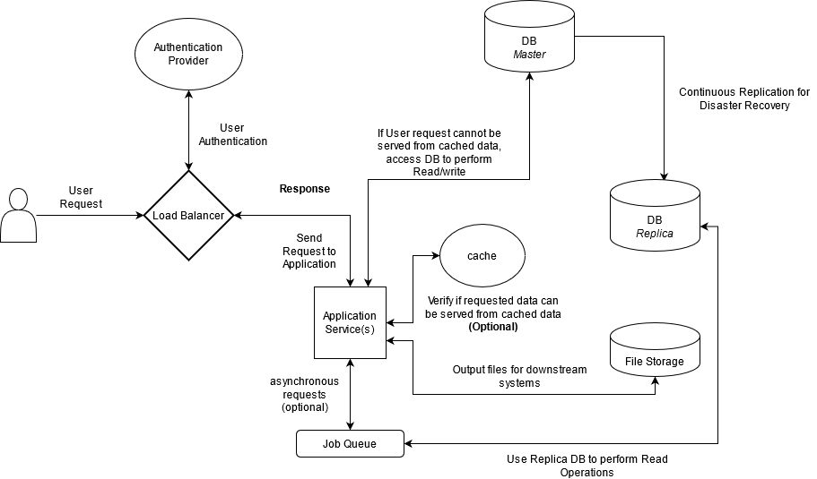
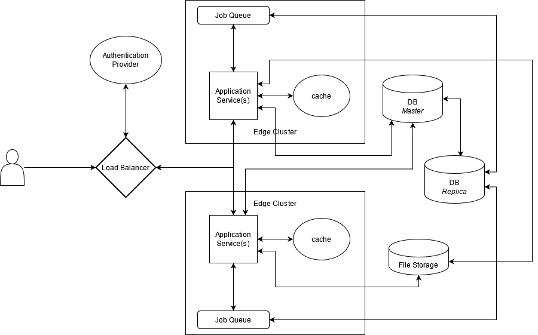

# Software Application Architecture Details

This software architecture diagram is suitable for a web application. Below are the assumptions made:

- Web application suitable for a flight booking system.
- Analytics reuqests are treated as async requests and can be served with a job pipeline setup.
- DB setup with replication is outside cluster. This can also be placed inside cluster with Load balancer (like AWS).
- Horizontal scalling of application is availble within edge regions.
- Load Balancer has the capability to distribute the traffic based on the User Request Region.

## Architecture Diagram (without Edge Regions)

## Architecture with Edge Regions

>**Note:** Software architecture will vary based on the use casea. 